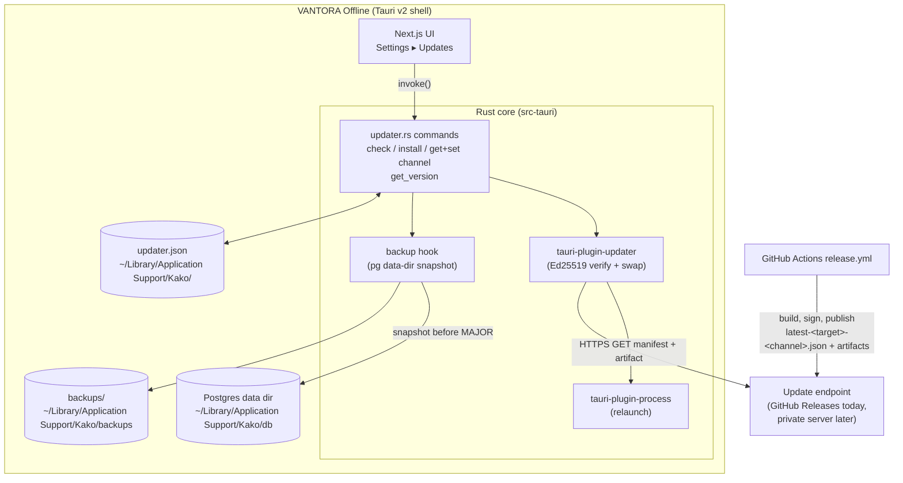
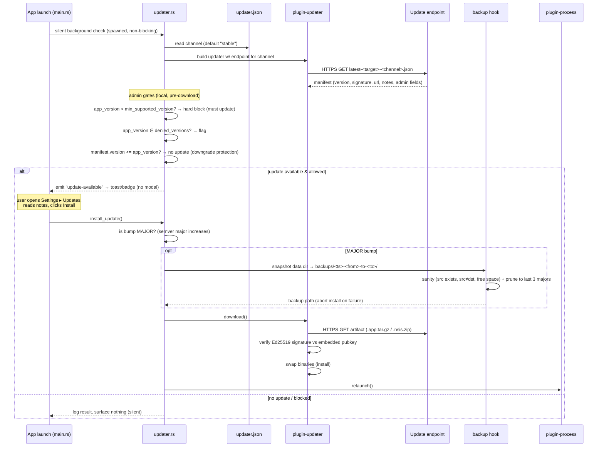

# VANTORA Offline Edition — Auto-Update Architecture

> Status: **design + initial implementation** (branch `feat/auto-updater`).
> Scope: the self-contained desktop build (Tauri v2 shell + bundled
> Postgres/PostgREST/Node sidecars). The hosted/web edition updates by redeploy
> and is out of scope here.

---

## 1. Goals & non-goals

**Goals**

- Fully automatic update path: silent background check on launch, one-click install.
- Two release channels — `stable` and `beta` — switchable from Settings and
  persisted across launches.
- The bundled Postgres **data directory is never touched** by an update, and is
  **backed up before every MAJOR version bump**.
- Cryptographically verified payloads (Tauri Ed25519), HTTPS-only, with
  downgrade protection.
- Admin levers: `min_supported_version`, a `denied_versions` deny-list, and
  release notes shown in the install dialog.
- Endpoint is config-driven so GitHub Releases can be swapped for a private
  update server with **zero code changes** (only `tauri.conf.json` edits).
- macOS arm64 + x86_64 now (separate artifacts); schema and flow are
  Windows-ready (`windows-x86_64` already in the manifest contract).

**Non-goals (for this iteration)**

- No periodic background polling — we check **on launch only**. (Defensible
  default for a single-tenant on-premise box that is restarted daily; a timer
  can be added later without touching the manifest contract.)
- No delta/binary-diff updates — full artifact download each time.
- No forced updates by default — the user can defer (the admin `min_supported_version`
  lever exists for the hard-stop case).
- Linux is not a target.

---

## 2. Why `tauri-plugin-updater`

We use the official **`tauri-plugin-updater` (v2)** rather than a hand-rolled
download/swap routine:

- **Signature verification is built in.** The plugin verifies an Ed25519
  signature over the artifact against a public key embedded in the app *before*
  it is applied. Rolling our own signature check is exactly the kind of security
  code you do not want to own.
- **Platform-correct install/relaunch.** It knows how to swap an `.app` bundle
  on macOS and run an NSIS/MSI installer on Windows, then relaunch via
  `tauri-plugin-process`. This is fiddly, OS-specific code.
- **Config-driven endpoints with templating.** `endpoints` supports
  `{{target}}`, `{{arch}}`, `{{current_version}}` substitution, which is exactly
  the indirection we need to move from GitHub Releases to a private server later.
- **First-party + maintained** alongside the rest of our Tauri v2 stack
  (`tauri-plugin-shell` is already in use).

We layer **two project-specific concerns on top** of the plugin, because the
plugin has no opinion about them:

1. **Channel selection** (`stable` vs `beta`) — implemented by pointing the
   updater at a channel-specific manifest URL, persisted in our own
   `updater.json`.
2. **Pre-install data-dir backup on MAJOR bumps** — implemented as a Rust hook
   that runs *before* `install()` is allowed to proceed.

Both live in our `updater.rs` module; the plugin does the cryptography and the
binary swap.

---

## 3. Component overview



Key boundaries:

- **The UI never downloads or verifies anything.** It calls Rust commands and
  renders state. All trust decisions are in Rust.
- **`updater.json` is the only mutable config** the updater owns. The Postgres
  data dir and backups live beside it but are never in the update payload.
- **The endpoint is the only thing that changes** when we migrate off GitHub
  Releases.

---

## 4. Update flow



Notes on the flow:

- **Silent by default.** On launch we check and, if there is an update, surface
  a non-blocking toast/badge. We do *not* pop a modal — the user installs from
  Settings on their own schedule. (For a hard `min_supported_version` violation
  the UI shows a blocking banner instead.)
- **Admin gates run locally, before any download.** A denied or below-minimum
  version is decided from the manifest fields without trusting the network
  beyond the signed manifest.
- **Backup is a hard precondition for MAJOR installs.** If the snapshot or its
  sanity checks fail, the install aborts and the old version keeps running on
  the untouched data dir.
- **Signature verification happens inside the plugin**, after download and
  before swap. We never execute or move an unverified artifact.

---

## 5. Manifest schema

One manifest **per (target-channel)** pair, published as a GitHub Release asset
named `latest-<target>-<channel>.json`, e.g.
`latest-darwin-aarch64-stable.json`. The `tauri.conf.json` `endpoints` entry
templates the filename from `{{target}}` and the channel.

> We keep the standard Tauri updater fields (`version`, `pub_date`,
> `platforms.<key>.{signature,url}`, `notes`) so the plugin consumes the
> manifest natively, and **add** our admin fields (`channel`,
> `min_supported_version`, `denied_versions`, `release_notes`). The plugin
> ignores unknown fields; our Rust layer reads the admin ones. `notes` mirrors
> `release_notes` for plugin-native rendering.

### 5.1 Field contract

| Field | Type | Meaning |
|---|---|---|
| `version` | semver string | Version this manifest advertises (e.g. `1.4.0`, `1.4.0-beta.2`). |
| `channel` | `"stable"` \| `"beta"` | Channel this manifest belongs to. Sanity-checked against the requested channel. |
| `pub_date` | RFC 3339 timestamp | Publish time. Informational. |
| `platforms` | object | Keyed by Tauri target triple key. |
| `platforms.<key>.url` | HTTPS URL | Artifact download URL. |
| `platforms.<key>.signature` | string | Tauri Ed25519 detached signature (contents of the `.sig` file). |
| `release_notes` | markdown string | Shown in the install dialog. |
| `notes` | markdown string | Mirror of `release_notes` for plugin-native consumption. |
| `min_supported_version` | semver string | Apps older than this must update (hard block). |
| `denied_versions` | semver string array | Versions explicitly forbidden from running / from being an update target. |

Platform keys (the manifest always carries all three slots; unbuilt targets may
be omitted or left without a `url`):

- `darwin-aarch64` — macOS Apple Silicon
- `darwin-x86_64` — macOS Intel
- `windows-x86_64` — Windows 64-bit (schema-ready; not built yet)

### 5.2 Example

```json
{
  "version": "1.4.0",
  "channel": "stable",
  "pub_date": "2026-06-06T12:00:00Z",
  "min_supported_version": "1.2.0",
  "denied_versions": ["1.3.4", "1.3.5"],
  "release_notes": "## 1.4.0\n\n- Faster end-of-day close\n- Fixes receipt printer reconnect\n",
  "notes": "## 1.4.0\n\n- Faster end-of-day close\n- Fixes receipt printer reconnect\n",
  "platforms": {
    "darwin-aarch64": {
      "url": "https://github.com/nabilhahaha/Kako/releases/download/v1.4.0/Kako_1.4.0_aarch64.app.tar.gz",
      "signature": "dW50cnVzdGVkIGNvbW1lbnQ6IHNpZ25hdHVyZSBmcm9tIHRhdXJp..."
    },
    "darwin-x86_64": {
      "url": "https://github.com/nabilhahaha/Kako/releases/download/v1.4.0/Kako_1.4.0_x64.app.tar.gz",
      "signature": "dW50cnVzdGVkIGNvbW1lbnQ6IHNpZ25hdHVyZSBmcm9tIHRhdXJp..."
    },
    "windows-x86_64": {
      "url": "https://github.com/nabilhahaha/Kako/releases/download/v1.4.0/Kako_1.4.0_x64-setup.nsis.zip",
      "signature": ""
    }
  }
}
```

> Artifact file names above are illustrative. The real names are derived from
> `productName` in `src-tauri/tauri.conf.json` at build time and are not
> hard-coded anywhere in the updater — the CI manifest step reads the actual
> built artifact name. The updater logic treats them as opaque URLs, so the
> product can be renamed without touching update code.

---

## 6. Versioning strategy

**Single source of truth: root `package.json` `version`.**
`scripts/sync-version.mjs` propagates it to `src-tauri/tauri.conf.json`
(`version`) and `src-tauri/Cargo.toml` (`package.version`). Run it after every
bump; CI fails the release if the three are out of sync.

- **Scheme:** standard [semver]. `MAJOR.MINOR.PATCH`, with a beta pre-release
  suffix `MAJOR.MINOR.PATCH-beta.N` (e.g. `1.4.0-beta.2`).
- **Channels map to branches and tags:**
  - `main` branch → **stable** channel. Release tags `v1.4.0`.
  - `beta` branch → **beta** channel. Release tags `v1.4.0-beta.2`.
- **Channel inference in CI** is purely from the tag name:
  `v*-beta.*` → `beta`, anything else `v*` → `stable`.
- **A beta user is offered both** beta and stable builds (whichever channel they
  selected); a stable user is only offered stable. Switching from beta back to
  stable does *not* auto-downgrade — downgrade protection still applies, so the
  stable build only installs once stable's version exceeds the running beta.

### Version compare rules (in `updater.rs`)

- **Update offered** iff `manifest.version > current_version` (semver compare,
  pre-release aware) **and** `manifest.version ∉ denied_versions`.
- **Downgrade protection:** `manifest.version <= current_version` ⇒ never offered.
- **Hard block:** `current_version < min_supported_version` ⇒ app refuses to run
  normally and the UI forces the update.

---

## 7. Data safety

The bundled Postgres state is the customer's business data. It must survive
every update untouched.

**Path facts (confirmed against `scripts/offline/lib.mjs` → `offlinePaths`):**

| What | Path (macOS) |
|---|---|
| Offline home root | `~/Library/Application Support/Kako/` |
| Postgres data dir | `~/Library/Application Support/Kako/db` |
| Backups dir | `~/Library/Application Support/Kako/backups` |
| Updater config | `~/Library/Application Support/Kako/updater.json` |

(Windows resolves the same logical tree under `%PROGRAMDATA%`/`%LOCALAPPDATA%`,
via the same `offlineHome` helper — no mac-only assumption.)

**Why the data dir can never be in the update payload:** the update artifact is
the application bundle (`.app` / NSIS installer) produced from `src-tauri`. The
data dir lives in Application Support, **outside** the bundle, and is created at
first run by `scripts/offline/bootstrap.mjs`. The updater swaps only the bundle.
There is no code path that packages Application Support into a release artifact —
the CI build runs on a clean runner with an empty Application Support tree.

### Pre-install backup (MAJOR bumps only)

Before a MAJOR install, the backup hook snapshots the **entire data dir** into:

```
~/Library/Application Support/Kako/backups/<ISO-timestamp>-<from_version>-to-<to_version>/
```

e.g. `2026-06-06T12-00-00Z-1.9.3-to-2.0.0/`.

- **"Major"** = the semver MAJOR component increases (`1.x.y` → `2.0.0`). MINOR
  and PATCH installs skip the backup (data layout is migration-compatible within
  a major line).
- **Mechanism:** a filesystem copy of the data dir while Postgres is stopped
  (the updater runs at launch/exit boundaries where pg is down, or stops it
  first). This is a physical snapshot — distinct from the logical `pg_dump`
  layer in `scripts/offline/backup.mjs`, which remains the routine/DR backup.
- **Retention: keep the last 3 MAJOR backups**, delete older. (Default; pruning
  counts directories matching the `*-to-<major>.*` pattern.)
- **Sanity guards before copying:** source dir exists and is non-empty, source ≠
  target, and free space on the volume ≥ source size × 1.1. Any failure aborts
  the install — the running app and its data are left untouched.

The hook returns the backup path so the UI can show "Backed up to …" and so a
failed update can be rolled back manually via the existing
`scripts/offline/rollback.mjs` flow.

---

## 8. Security & threat model

### Controls

- **Ed25519 signing.** Artifacts are signed in CI with the private key held only
  in the `TAURI_SIGNING_PRIVATE_KEY` secret (passphrase in
  `TAURI_SIGNING_PRIVATE_KEY_PASSWORD`). The matching **public key is embedded**
  in `tauri.conf.json` and compiled into the app. The plugin verifies the
  detached signature over the downloaded artifact before applying it.
- **HTTPS-only endpoints.** All `endpoints` are `https://`. No plaintext fetch.
- **Downgrade protection.** The updater refuses any `manifest.version <=
  current_version`, so a rolled-back/replayed manifest cannot push an older
  (possibly vulnerable) build.
- **Admin deny-list + minimum version.** `denied_versions` lets us pull a bad
  build; `min_supported_version` lets us force-retire insecure versions.
- **Backup-before-major.** Limits blast radius of a bad major: data is snapshot
  first and the install aborts if it can't be.

### Threat model (brief)

| Threat | Mitigation |
|---|---|
| Attacker serves a malicious artifact (compromised CDN/MITM) | Ed25519 signature verified against embedded pubkey; HTTPS transport. A forged artifact fails verification and is discarded. |
| Attacker replays an old signed manifest to force a downgrade | Downgrade protection (`version <= current` rejected). |
| A signed-but-broken build ships | `denied_versions` deny-list + ability to publish a higher good version; routine + pre-major backups enable recovery. |
| Update corrupts/loses business data | Data dir is outside the payload; physical snapshot before every major; sanity-gated and abortable. |
| Stolen signing key | Out of scope to *prevent* here, but: key lives only in CI secrets, never in the repo (`.gitignore` excludes the `.pem`); rotation = ship a new pubkey in a stable build before retiring the old key. |
| Endpoint takeover used to stop updates (suppress security fixes) | Detectable operationally; `min_supported_version` on the last-known-good manifest still hard-blocks very old clients. |

**Trust anchor:** the embedded public key. Everything else (endpoint, CDN,
manifest contents) is treated as untrusted and validated against it or against
local policy.

---

## 9. Migrating off GitHub Releases (future)

To move to a private update server, change **only** `tauri.conf.json`:

```jsonc
"endpoints": [
  "https://updates.vantora.example/{{target}}/latest-{{target}}-stable.json"
]
```

No Rust, UI, manifest, or CI-script changes are required as long as the new
server serves the same manifest contract and the same signed artifacts. The
keypair is unchanged, so already-installed clients keep trusting the new server's
payloads.

---

## 10. File map (this feature)

| Path | Role |
|---|---|
| `docs/offline/auto-update.md` | This document. |
| `src-tauri/src/updater.rs` | Rust commands, channel persistence, backup hook. |
| `src-tauri/src/main.rs` | Plugin registration + silent launch check. |
| `src-tauri/tauri.conf.json` | `plugins.updater` block, pubkey, install mode. |
| `src-tauri/Cargo.toml` | `tauri-plugin-updater`, `tauri-plugin-process`. |
| `src/app/(app)/settings/updates/` | Settings ▸ Updates UI. |
| `scripts/sync-version.mjs` | Propagate version to tauri.conf + Cargo.toml. |
| `scripts/release/generate-manifest.mjs` | Build per-target/channel manifest in CI. |
| `.github/workflows/release.yml` | Tag-triggered build/sign/publish. |

---

## 11. Industry-agnostic (read this before extending)

**The Offline Edition is a generic platform engine.** It ships one desktop
runtime — Tauri shell + bundled Postgres/PostgREST/Node — that loads *any*
industry model purely from configuration at runtime. Industry behaviour
(retail, fashion, pharmacy, clinic, FMCG, …) is data, not code paths baked into
the runtime, the updater, the packaging, or the local DB layout. The runtime
resolves everything it shows from config dimensions such as:

- `enabled_modules` — which feature modules are active
- `industry_packs` — the vertical descriptor loaded for the tenant
- `dynamic_fields` — per-entity custom fields
- `permissions` — capability set
- `workflows`, `reports`, `terminology`, `dashboard_widgets`

**Rules for anyone touching the updater / packaging / data layer:**

1. **No industry names in this subsystem.** No `fashion`, `retail`, `pharmacy`,
   `clinic`, `fmcg`, `clothing`, `restaurant` in updater code, config field
   names, enum values, channel names, manifest fields, artifact/release naming,
   backup/data-dir paths, or the Updates Settings UI gating. Channels are
   exactly `stable` / `beta` — never `fashion-stable` and the like.
2. **Module enable/disable is out of scope for the updater.** Modules are handled
   by the existing config/edition layer (`src/lib/edition/*`,
   `scripts/offline/lib.mjs` edition mapping). The updater only replaces the app
   binary and never reasons about which modules a tenant runs.
3. **Generic data-dir naming.** Paths are platform-named only:
   `~/Library/Application Support/Kako/{db,backups,updater.json}`. `Kako` is the
   platform name. Never introduce an industry-suffixed dir or file
   (no `fashion_data/`, `pharmacy.json`, …).
4. **The Updates Settings panel is platform-level.** It lives at the generic
   `/settings/updates` route and is gated by the generic `settings.users`
   permission only — not by any industry module permission. It must render
   identically regardless of which industry pack is loaded.
5. **Product identity is the one configurable surface.** Artifact/window/app
   names come from `productName`/`identifier` in `tauri.conf.json`. The updater
   treats artifact URLs as opaque, so renaming the product (or shipping
   per-brand builds) needs zero updater changes. If a product/brand rename is
   desired, that is a deliberate config decision made outside this subsystem.

If a change here seems to *require* picking a specific industry, it's a design
smell — stop and reconsider, the runtime should stay vertical-neutral.

[semver]: https://semver.org/
